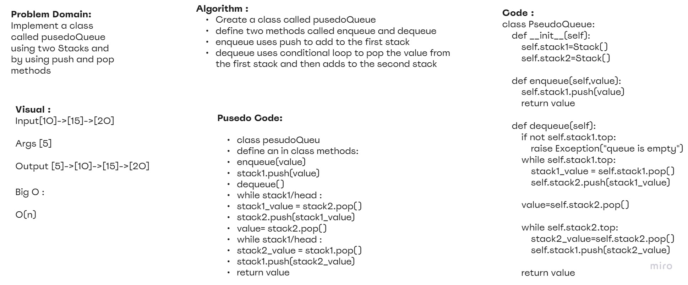

# Challenge Summary
- **Implement a Queue using two Stacks**
## Whiteboard Process

## Approach & Efficiency
- big O effeciency is O(n) time
- big O effeciency is O(n) Space

## Solution

    pseudo_queue.enqueue(1)
    pseudo_queue.enqueue(444)
    pseudo_queue.enqueue('gggg')

    pseudo_queue.enqueue(1)
    pseudo_queue.enqueue(444)
    pseudo_queue.enqueue('gggg')

