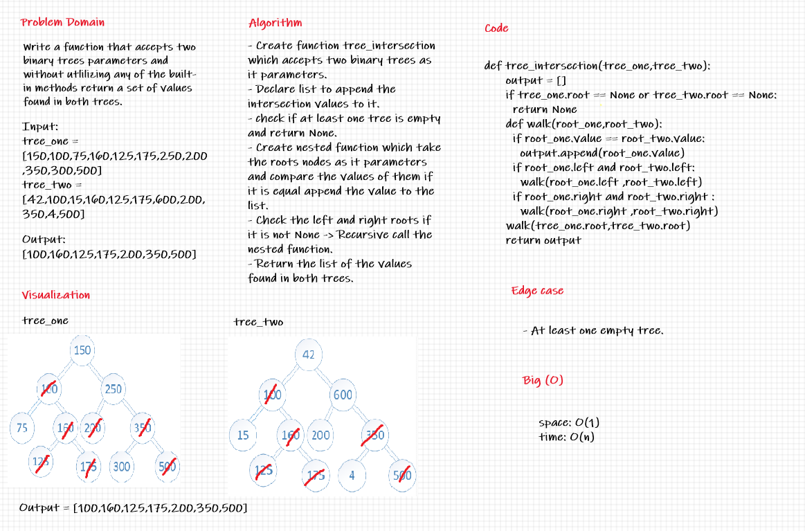

# Code Challenge 32

## Hashmap Tree Intersection
  * Find common values in 2 binary trees.
  
## Challenge Summary
  * Write a function that accepts a lengthy string parameter.
  * Without utilizing any of the built-in library methods available to your language, return a set of values found in both trees.
  
## Whiteboard Process
 

## Approach & Efficiency
  * Time: O(n)
  * Space: O(1)
  
## Tasks:
  - [x] Top-level README “Table of Contents” is updated.
  - [x] Feature tasks for this challenge are completed.
  - [x] Unit tests written and passing.
  - [x] Edge Case (if applicable/obvious).
  - [x] README for this challenge is complete.
  - [x] Description, Approach & Efficiency, Solution.
  - [x] Link to code.